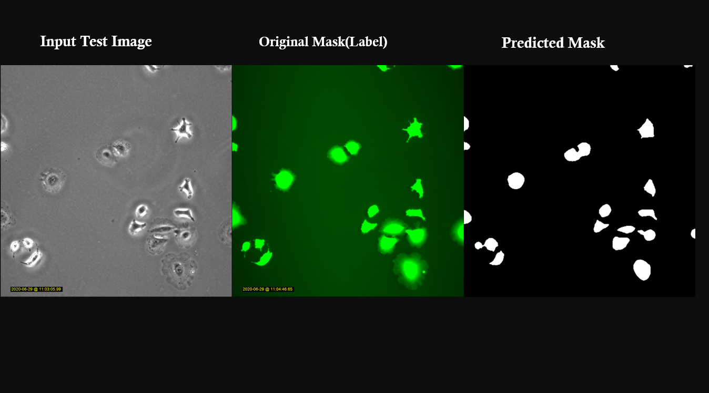

[](https://doi.org/10.5281/zenodo.3928919)
 

[](https://badge.fury.io/py/cytounet) 
[](https://pypi.python.org/pypi/cytounet/)
[](https://pypi.python.org/pypi/cytounet/) 

[](https://GitHub.com/Nelson-Gon/cytounet/graphs/commit-activity)
[](https://github.com/Nelson-Gon/cytounet/commits/master)
[](https://GitHub.com/Nelson-Gon/cytounet/issues/)
[](https://GitHub.com/Nelson-Gon/cytounet/issues?q=is%3Aissue+is%3Aclosed)


---

**Background about this project**



This project was largely done as a summer intern in Dr. Mikael [Bjorklund](https://person.zju.edu.cn/en/H118035)'s  lab.

The aim was to automate [a549](https://en.wikipedia.org/wiki/A549_cell) cancer cell
segmentation and size determination. 

Sample data(10 random images each of train, validate, test sets) is provided in [original_data](https://github.com/Nelson-Gon/cytounet/tree/master/examples/original_data/a549).

A complete a549 cancer cell segmentation [notebook](https://github.com/Nelson-Gon/cytounet/blob/20435549e6b4c3d15979c2117445c4c19ab51bdf/examples/a549_sampler.ipynb) is also provided. 

Finally, pre-trained [weights](https://github.com/Nelson-Gon/cytounet/blob/56694553e5014e3f479807de244f5ddeabbcbf80/models/a549_scratch.hdf5) are provided that can be used for transfer learning. These were trained on considerably more data
and for more epochs. 

**Note**
 
* To generate masks(labels) provided here `a549` cancer cells were stained and imaged with fluorescence microscopy. These 
fluorescent images were then thresholded with `threshold_images` with a threshold value of 83. The images were then saved 
with `save_images`. The original fluorescent images are not provided here mainly due to the already huge size of the 
project. 

* This project is not limited to cancer cells. The model can be trained on almost any object, living and non-living.
More examples are given below. 


---

**Installation**

From `PyPI`:

```

pip install cytounet

```


From source or to use without installing locally:

```
git clone https://github.com/Nelson-Gon/cytounet.git
# proceed with usual source build procedure

```

Or:

```python

pip install git+https://github.com/Nelson-Gon/cytounet.git

```

**Import**

```python

from cytounet.model import *
from cytounet.data import *
from cytounet.augmentation import *
from cytounet.post_model import *

```

**Detailed Sample Usage**

Please see the following examples:

* [Typical Usage](https://github.com/Nelson-Gon/cytounet/blob/7fd42a27be1b5730eb05e60cb98d5b7e825a0087/examples/example_usage.ipynb)

[](https://nbviewer.jupyter.org/github/Nelson-Gon/cytounet/blob/7fd42a27be1b5730eb05e60cb98d5b7e825a0087/examples/example_usage.ipynb)


* [Predicting Embryonic DIC Image Labels with Keras](https://www.kaggle.com/gonnel/predicting-embryonic-dic-image-labels-with-keras)

[](https://nbviewer.jupyter.org/github/Nelson-Gon/cytounet/blob/aedf8d52af4e3e9f2cd426de90b4c5dea2a4e11c/examples/embryos_dic.ipynb)


Visually:


Sample Object Area Visualization(see the typical usage notebook above for detailed usage)


For more examples or to add your own, please see the examples [folder](https://github.com/Nelson-Gon/cytounet/blob/master/examples).

**Experiments/Benchmarks**

This section shows some experimental results based on publicly available data. 

* Comparison of low vs high quality masks on the model's output

This notebook shows the effects of "filled holes"(outlines whose area is filled with some colour e.g white)
on the model's quality. The results in general show that filled masks which are also better seen by the human eye
result in better quality output. 

The [notebook](https://github.com/Nelson-Gon/cytounet/blob/9781a45260bd8cdb82b37e07a26254ecf01af5c7/examples/example_usage.ipynb) can be accessed via this [link](https://nbviewer.jupyter.org/github/Nelson-Gon/cytounet/blob/9781a45260bd8cdb82b37e07a26254ecf01af5c7/examples/example_usage.ipynb).


**TODO List**

A checked box indicates support. You can either add more feature requests here or tackle unchecked boxes and make
a pull request to add such support. 


- [x] Single class segmentation

- [x] Grayscale images

- [x] Model Validation

- [x] Determining areas of objects in an image

- [ ] Custom Number of Layers

- [ ] Multi-class segmentation

- [ ]  Colored image input

- [ ] COCO Datasets 

- [ ] CSV Based Annotations

- [ ] XML Based Annotations 

**Frequently Asked Questions**

Please read our Wiki [Pages](https://github.com/Nelson-Gon/cytounet/wiki)

**To raise an issue or question**

If the [wiki](https://github.com/Nelson-Gon/cytounet/wiki) does not answer your question,
please raise a new [issue](https://github.com/Nelson-Gon/cytounet/issues). You can also open an issue if you have any discussion, criticism,
or bug reports. 

Thank you very much. 

---

**References**

* Mouse Embryos [Dataset obtained](https://github.com/Nelson-Gon/cytounet/tree/master/examples/BBBC003_v1) from Broad Bioimage Benchmark Collection.
[Source](https://data.broadinstitute.org/bbbc/BBBC003/).

* Red Blood Cell [Images](https://github.com/Nelson-Gon/cytounet/tree/master/examples/BBBC009_v1) provided by Anne 
Carpenter and Roger Wiegand, available [here](https://data.broadinstitute.org/bbbc/BBBC009/)

* Chinese Hamster Ovary [Cells](https://github.com/Nelson-Gon/cytounet/tree/master/examples/BBBC030_v1) provided by 
Koos et al.([2016](https://bbbc.broadinstitute.org/BBBC030))

**Credits**

* This repository started out as a clone of [zhixuhao](https://github.com/zhixuhao)'s  original 
unet [implementation](https://github.com/zhixuhao/unet/).

This repository has considerably diverged from the original implementation hence the need
to distribute it separately. 

This decision was taken in part due to the relative inactivity of the original implementation which would have made
it harder to collaborate. Please take a look at the list of [changes](https://github.com/Nelson-Gon/cytounet/blob/master/changelog.md) 
from the original implementation. 

* The Unet algorithm was introduced by Ronneberger et al. in their [paper](http://lmb.informatik.uni-freiburg.de/people/ronneber/u-net/).


